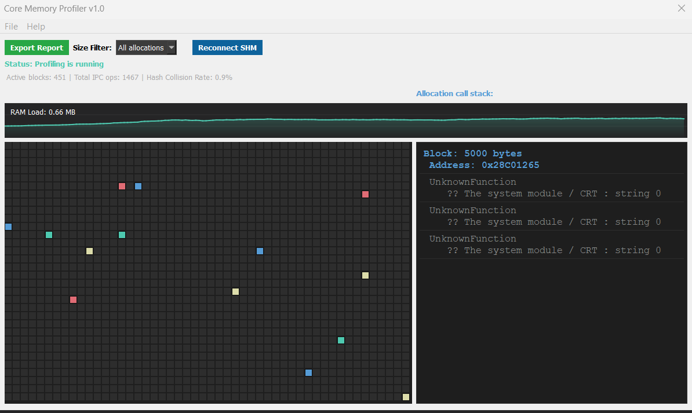

# Core Memory Profiler (CMP) 🚀


A high-performance, real-time dynamic memory allocation tracker for Windows applications. Built with pure enthusiasm to solve the overhead problem in modern memory profiling.

This project was developed from scratch to create a lightweight tool that hooks into native `new/delete` or `malloc/free` operations and visualizes memory usage in real time with virtually zero latency. It achieves this by using a lightning-fast, lock-free fixed hash table hosted inside Win32 Shared Memory (IPC) combined with a highly responsive Qt-based graphical dashboard.

---

## 🌟 Key Features

* **Zero-Latency Tracking ($O(1)$ Complexity):** Leverages an open-addressed cyclic hash table with a linear probing limit ($MAX\_PROBES = 32$) to guarantee predictable, atomic, and deterministic allocation tracking without stalling target threads.
* **Lock-Free Shared Memory IPC:** Avoids slow OS-level synchronization primitives or socket overhead. The data is shared instantly between the target process and the monitoring GUI via Win32 Shared Memory (`CreateFileMappingA` / `MapViewOfFile`).
* **Visual Allocation Heap Map:** A responsive, pixel-perfect visualization grid displaying active memory blocks classified and color-coded by size.
* **On-the-Fly Filtering:** Instantly filter allocations by threshold size classes (e.g., small structs, larger objects, heavy pages) without losing historical telemetry.
* **Automated Win32 Call Stack Resolution:** Deep native call stack unwinding utilizing Microsoft's `dbghelp.lib` to pinpoint exactly which function or system routine triggered an allocation.
* **Real-Time Analytics & Mathematical Insights:** Includes an integrated live RAM timeline chart and a built-in **Hash Collision Rate** tracker to observe internal data structure efficiency in real time.
* **Developer Export System:** One-click structured reporting allowing the export of currently active heap maps into clean text summaries or `.csv` files ready for Microsoft Excel data analysis.

---

## 🏗️ Architectural Overview

The project is split into two tightly coupled modules designed to balance high performance and modern UI aesthetics:

1. **The Core Instrumentation Hook (Back-End):**
   * Intercepts memory management operations.
   * Computes a highly efficient hash based on the memory address pointer.
   * Maps allocation records (Address, Size, Timestamp, Call Stack Frames) into a shared memory payload layout using relaxed memory ordering and atomic compare-and-swap (`compare_exchange_strong`) loops.

2. **The Monitor Dashboard (Front-End UI):**
   * A standalone Qt application that establishes a clean, decoupled reader connection to the shared memory file mapping.
   * Uses an optimized rendering tick layout that polls data and redraws only on data version changes (`changeCounter` detection).
   * Fully custom-rendered graphical grid layout constructed using native `QPainter` instructions.

---


## 🎨 Visualization Color Reference


Memory blocks are dynamically color-coded based on their size in bytes to quickly identify heavy footprint hotspots:


| Color | Allocation Size Class | Typical Use Case |
| :--- | :--- | :--- |
| **Mint (`#4EC9B0`)** | $\le 32$ bytes | Primitive types, tiny structures, short strings |
| **Blue (`#569CD6`)** | $32 \text{ bytes} < \text{Size} \le 512 \text{ bytes}$ | Standard object instances, mid-sized structures |
| **Yellow (`#DCDCAA`)** | $512 \text{ bytes} < \text{Size} \le 4096 \text{ bytes}$ | Internal data buffers, complex structural nodes |
| **Red (`#E06C75`)** | $> 4096$ bytes | Heavy dynamic arrays, raw images, page-aligned buffers |


---


## 🛠️ Prerequisites \& Build Guide


### Requirements

* **Operating System:** Windows 10/11 (X64 architectures)

* **Compiler:** MSVC (Microsoft Visual C++ Component) supporting C++17 or later (Required for `dbghelp.lib` stack walks and Win32 Interlocked intrinsics)

* **Framework:** Qt 5.15+ or Qt 6.x (Core, Widgets, Gui modules)

* **Build System:** CMake 3.16+ or `.pro` qmake project engine


### Building from Source


1\. Clone or download this repository to your workspace.

2\. Open the project directory via \*\*Qt Creator\*\* or configure it via terminal:
```bash
mkdir build \&\& cd build

&#x20;  cmake .. -DCMAKE\_BUILD\_TYPE=Release

&#x20;  cmake --build .
```


### 🚀 Running the Enthusiast Simulation

To observe the dynamic real-time memory fragmentation, memory leak tracking, and hash collision mechanics without hooking a production engine immediately, the project contains an embedded simulation module inside main.cpp.


Upon starting, the simulation thread spins up and allocates hundreds of pseudo-random, multi-sized buffers every 30ms to create an organic, realistic heap workload pattern.


* Watch the grid paint itself with high-density mosaic structures.


* Toggle the Size Filter drop-down to see instant data culling.
* Track the Hash Collision Rate % to view mathematical behavior under stress.
* Hit Export Report to dump a full snapshot analysis of the heap status!


### 📜 License \& Intent

This project is shared entirely in the spirit of open-source engineering, low-level optimization exploration, and tool development enthusiasm. Feel free to fork, expand, modify, or embed this tracking core into your custom game engines, database experiments, or memory-sensitive desktop frameworks!




